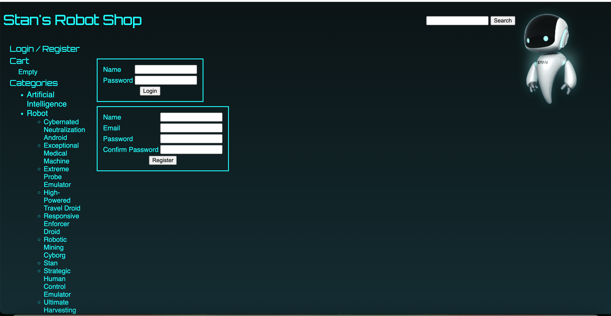
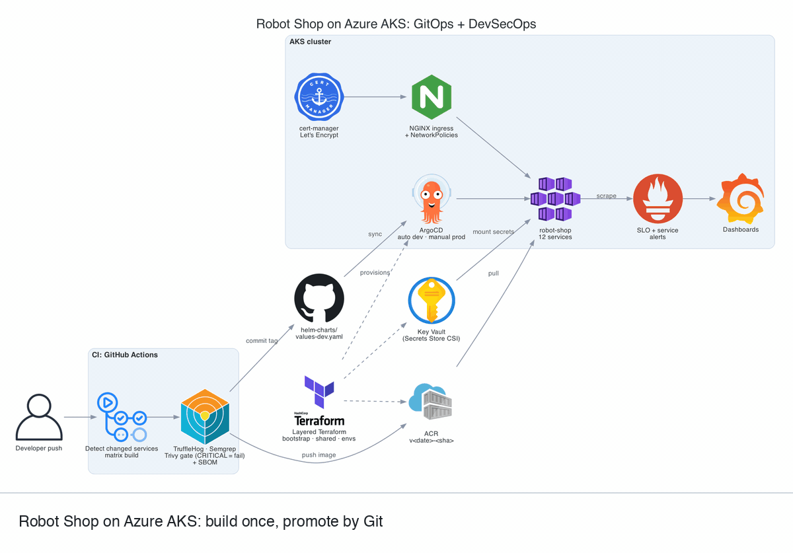
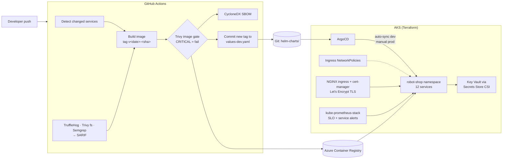

# Robot Shop on Azure AKS: GitOps + DevSecOps Platform

A production-style platform for a 12-service polyglot application on Azure Kubernetes Service. It covers layered Terraform, a build-once/promote-by-Git pipeline with security gates, ArgoCD, Key Vault-backed secrets, and Prometheus/Grafana SLO alerting.

> The application is the open-source [Stan's Robot Shop](https://github.com/instana/robot-shop) by Instana; I did not write the app. **I built everything around it**: infrastructure, pipelines, Helm charts, GitOps, secrets, networking and observability.



---

## 1. Problem

A microservices app written in five languages (Node.js, Java, Python, Go, PHP), with MySQL, MongoDB, Redis and RabbitMQ, is a realistic stand-in for what most teams run. The question this repo answers: **how do you give a team like that a platform where every change is scanned, every deploy is a Git commit, secrets never touch the repo, and you can tell when a service is breaking its SLO?**

## 2. Architecture



<sub>Static diagram: [docs/images/architecture.png](docs/images/architecture.png)</sub>



**Terraform layout** (`terraform/`):

| Layer | Purpose |
|---|---|
| `bootstrap/` | Local state; creates the Azure Storage backend for everything else |
| `shared/` | Resources shared across environments |
| `environments/{dev,staging,prod}` | Read bootstrap/shared via `terraform_remote_state` and compose modules |
| `modules/` | `aks`, `networking`, `storage` (ACR), `keyvault`, `monitoring`, `databases`, `bastion`, `backend`, `github-federated-identity` |

## 3. Key decisions and trade-offs

- **Build once, promote by Git.** Images get an immutable `v<date>-<sha>` tag. The pipeline commits that tag into `values-dev.yaml`, and ArgoCD deploys it. There is no `kubectl` in CI, and rollback is `git revert`. Trade-off: the pipeline needs write access to the repo.
- **Only build what changed.** A change-detection action feeds a matrix build, so touching `cart/` rebuilds one image, not twelve.
- **Graduated security enforcement.** tfsec and Checkov soft-fail on `develop` and block elsewhere. The Trivy image gate uses `ignore-unfixed`, so it fails only on CRITICAL issues you can actually fix. Results go to GitHub code scanning as SARIF, and every image gets an SBOM.
- **Secrets from Key Vault, not Kubernetes manifests.** Terraform generates random passwords into Key Vault, and pods mount them through the Secrets Store CSI driver. The AKS cluster has the OIDC issuer and Workload Identity enabled.
- **Restricted pod ingress.** NetworkPolicies in the umbrella chart allow the web tier only from ingress-nginx, and add explicit rules for intra-app traffic and Prometheus scraping. An earlier namespace-wide default-deny caused problem #1 in the [engineering notes](docs/engineering-notes.md).
- **System vs user node pools.** The system pool runs with `only_critical_addons_enabled`; apps run on a separate autoscaling user pool.
- **Dev auto-syncs, prod doesn't.** ArgoCD self-heals and prunes in dev. Production requires a manual sync.

## 4. Known limitations / what I'd do next

- **The AKS API server is public** (`authorized_ip_ranges` is empty) and local accounts are enabled. Next: restrict to CI and admin IPs or make the cluster private, and enforce Entra ID auth.
- **CI authenticates with a service principal secret** (`AZURE_CREDENTIALS`), even though the federated-identity module exists. Next: switch every workflow to OIDC.
- **Key Vault purge protection is off, and ACR admin user is enabled.** Both are fine for a teardown-friendly dev environment, but wrong for production.
- **The bastion NSG allows SSH from anywhere.** It should be restricted to admin CIDRs or replaced with Azure Bastion.
- **`lifecycle.ignore_changes` on the AKS cluster is broad** (network profile, identity, etc.), which can hide drift.
- **Databases run in-cluster** as single-replica Deployments. For production I'd use Azure Database for MySQL, Cosmos DB (Mongo API) and Azure Cache for Redis. The `databases` module has a start on this.
- **Only dev was run continuously.** Staging and prod configs exist but weren't kept running (cost).
- **The latest CI runs are red** after a repo restructure (paths moved). Next: get them green.
- **No explicit default-deny policy is in the chart today.** Only the selected pods are restricted. Next: add default-deny ingress and egress, with an egress allow-list (DNS, Stripe, Key Vault).
- **The cart image is still on Node 14**, so the base images need a refresh.

## 5. Evidence

- **[Engineering notes](docs/engineering-notes.md):** five real problems and fixes:
  - A NetworkPolicy silently blocking Prometheus
  - A Helm values override breaking a DaemonSet
  - ArgoCD pruning an ingress
  - MongoDB OOM
  - 16 critical CVEs cleared from the cart image
- **Pipelines:** `.github/workflows/build-and-push.yml`, `infrastructure.yml`, `security-scan.yml`, `pr-validation.yml`
- **GitOps:** `argocd/`, `helm-charts/robot-shop/values-*.yaml` (image tags are committed by CI)
- **Alerting:** `helm-charts/monitoring/templates/*-alerts.yaml` (SLO, service and database alerts), Grafana dashboards in `helm-charts/monitoring/dashboards/`

## 6. Run it yourself

Prerequisites: Azure subscription, Azure CLI, Terraform ≥ 1.5, kubectl, Helm.

```bash
# 1. Remote state
cd terraform/bootstrap && terraform init && terraform apply

# 2. Dev environment
cd ../environments/dev
cp terraform.tfvars.example terraform.tfvars   # edit values
terraform init -backend-config="storage_account_name=<from bootstrap output>" \
               -backend-config="container_name=tfstate" \
               -backend-config="key=dev/terraform.tfstate" \
               -backend-config="resource_group_name=robot-shop-tfstate-rg"
terraform apply -var="backend_storage_account_name=<from bootstrap output>"

# 3. Cluster access + ArgoCD app
az aks get-credentials -g robot-shop-dev-rg -n robot-shop-dev-aks
kubectl apply -f argocd/robot-shop-dev.yaml
```

**Cost:** the dev environment (Standard-tier AKS, 1–2 × D2s_v3 nodes, Basic ACR, Log Analytics) runs at roughly **$150–250/month** in East US. Most of that is the node VMs and the AKS Standard tier; Free tier plus a single node brings it well under $100. **Run `terraform destroy` when you're done.**

---

**Abdihakim Said**, AWS Solutions Architect Associate · CKA. I build Kubernetes platforms, GitOps delivery and DevSecOps pipelines. Contact details are on my [GitHub profile](https://github.com/abdihakim-said).
