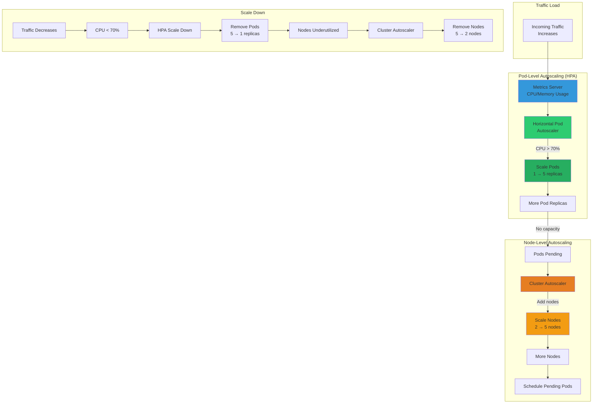

# Autoscaling Architecture



## Autoscaling Configuration

### Horizontal Pod Autoscaler (HPA)

#### Development
```yaml
HPA: Disabled
Replicas: Fixed (1 per service)
Reason: Cost optimization
```

#### Staging
```yaml
HPA: Enabled
Min Replicas: 1-2
Max Replicas: 3-5
Target CPU: 70%
```

#### Production
```yaml
HPA: Enabled
Min Replicas: 2-3
Max Replicas: 5-10
Target CPU: 70%
```

### Cluster Autoscaler

#### Development
```yaml
Min Nodes: 2
Max Nodes: 5
VM Size: Standard_DC2s_v3
```

#### Staging
```yaml
Min Nodes: 2
Max Nodes: 5
VM Size: Standard_D2s_v3
```

#### Production
```yaml
Min Nodes: 3
Max Nodes: 10
VM Size: Standard_D4s_v3
```

## Scaling Triggers

### Scale Up
1. **Traffic increases**
2. **CPU usage > 70% for 3 minutes**
3. **HPA creates new pod replicas**
4. **If no node capacity:**
   - Pods go to Pending state
   - Cluster Autoscaler adds nodes
   - Pods scheduled on new nodes

### Scale Down
1. **Traffic decreases**
2. **CPU usage < 70% for 5 minutes**
3. **HPA removes pod replicas**
4. **If nodes underutilized:**
   - Cluster Autoscaler removes nodes
   - Pods rescheduled if needed

## Example Scenario

### Normal Load
```
Traffic: 100 req/s
Pods: 2 replicas (web)
Nodes: 2
CPU: 40%
```

### High Load
```
Traffic: 500 req/s
Pods: 5 replicas (web) ← HPA scaled
Nodes: 3 ← Cluster Autoscaler added node
CPU: 65%
```

### Peak Load
```
Traffic: 1000 req/s
Pods: 10 replicas (web) ← HPA at max
Nodes: 5 ← Cluster Autoscaler at max
CPU: 70%
```

### Back to Normal
```
Traffic: 100 req/s
Pods: 2 replicas (web) ← HPA scaled down
Nodes: 2 ← Cluster Autoscaler removed nodes
CPU: 40%
```

## Benefits

✅ **Automatic**: No manual intervention
✅ **Cost-effective**: Scale down when not needed
✅ **Performance**: Scale up during peaks
✅ **Resilient**: Multiple replicas for HA
