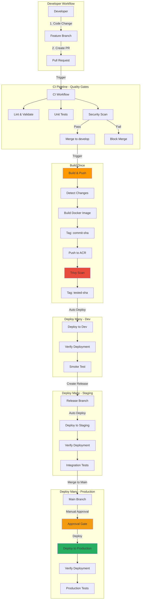

# CI/CD Pipeline Architecture

## Key Points

- **Build Once**: Single Docker image built and tagged with commit SHA
- **Deploy Many**: Same image deployed to dev, staging, and production
- **Security**: Trivy scanning integrated in build pipeline
- **Quality Gates**: CI validates before merge
- **Approval**: Manual approval required for production
