# Environment Promotion Flow

```mermaid
graph LR
    subgraph "Development"
        DEV_CODE[Code Change]
        DEV_BUILD[Build Image<br/>tag: abc123]
        DEV_DEPLOY[Deploy to Dev<br/>2 nodes<br/>No HPA]
        DEV_TEST[Smoke Tests]
    end

    subgraph "Staging"
        STG_DEPLOY[Deploy to Staging<br/>3 nodes<br/>HPA Enabled]
        STG_TEST[Integration Tests<br/>Performance Tests]
        STG_APPROVE[QA Approval]
    end

    subgraph "Production"
        PROD_APPROVE[Manual Approval<br/>Required]
        PROD_DEPLOY[Deploy to Production<br/>3-5 nodes<br/>HPA Enabled]
        PROD_VERIFY[Health Checks<br/>Monitoring]
    end

    DEV_CODE --> DEV_BUILD
    DEV_BUILD --> DEV_DEPLOY
    DEV_DEPLOY --> DEV_TEST
    DEV_TEST -->|Pass| STG_DEPLOY
    STG_DEPLOY --> STG_TEST
    STG_TEST --> STG_APPROVE
    STG_APPROVE -->|Pass| PROD_APPROVE
    PROD_APPROVE -->|Approved| PROD_DEPLOY
    PROD_DEPLOY --> PROD_VERIFY

    style DEV_BUILD fill:#ff9900
    style STG_DEPLOY fill:#3498db
    style PROD_APPROVE fill:#f39c12
    style PROD_DEPLOY fill:#27ae60
```

## Environment Characteristics

### Development
- **Purpose**: Fast iteration
- **Nodes**: 2 (min) - 5 (max)
- **Resources**: Minimal (30m CPU)
- **HPA**: Disabled
- **Deployment**: Automatic on merge
- **Cost**: ~$160/month

### Staging
- **Purpose**: Pre-production testing
- **Nodes**: 2 (min) - 5 (max)
- **Resources**: Medium (40-75m CPU)
- **HPA**: Enabled (1-3 replicas)
- **Deployment**: Automatic on release
- **Cost**: ~$180-250/month

### Production
- **Purpose**: Live traffic
- **Nodes**: 3 (min) - 10 (max)
- **Resources**: Optimized (50-100m CPU)
- **HPA**: Enabled (2-10 replicas)
- **Deployment**: Manual approval
- **Cost**: ~$400-800/month

## Promotion Criteria

### Dev → Staging
✅ All pods running
✅ Smoke tests pass
✅ No critical vulnerabilities

### Staging → Production
✅ Integration tests pass
✅ Performance acceptable
✅ QA approval
✅ Manual approval gate
