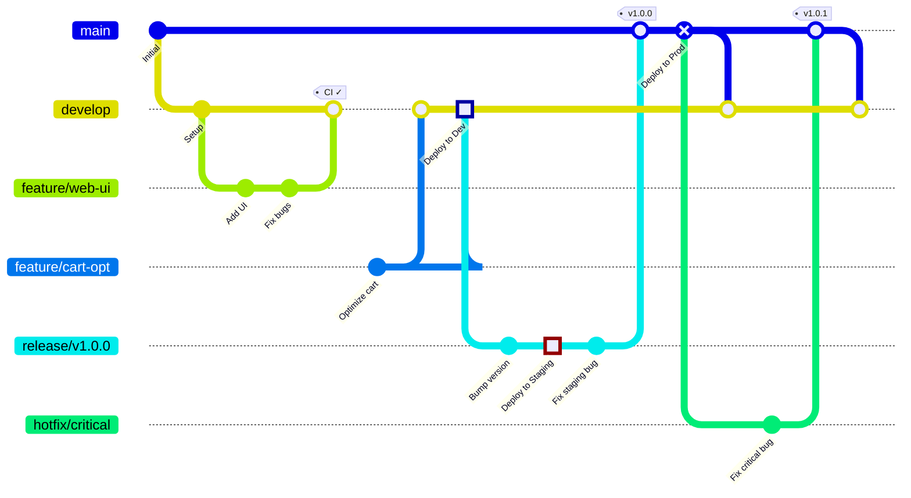

# GitFlow Branching Strategy

## Branch Strategy

### Permanent Branches
- **main**: Production releases
- **develop**: Integration branch

### Temporary Branches
- **feature/***: Feature development
- **release/***: Release preparation
- **hotfix/***: Production fixes

## Environment Mapping

| Branch | Environment | Deployment |
|--------|-------------|------------|
| develop | Development | Automatic |
| release/* | Staging | Automatic |
| main | Production | Manual Approval |

## Workflow

1. **Feature Development**: feature/* → develop
2. **Release Preparation**: develop → release/*
3. **Production**: release/* → main
4. **Hotfix**: main → hotfix/* → main
