# Infrastructure Architecture

```mermaid
graph TB
    subgraph "Azure Cloud"
        subgraph "Resource Group: robot-shop-dev-rg"
            subgraph "Networking"
                VNET[Virtual Network<br/>10.0.0.0/16]
                NSG[Network Security Group]
                SUBNET[AKS Subnet<br/>10.0.1.0/24]
                VNET --> SUBNET
                NSG --> SUBNET
            end

            subgraph "AKS Cluster"
                CLUSTER[AKS Cluster<br/>Kubernetes 1.31]
                NODES[Node Pool<br/>2-5 nodes<br/>Standard_DC2s_v3]
                CLUSTER --> NODES
                SUBNET --> NODES
            end

            subgraph "Container Registry"
                ACR[Azure Container Registry<br/>robotshopdevacrmtttm8]
            end

            subgraph "Storage"
                STORAGE[Storage Account<br/>Managed Disks]
                PVC[Persistent Volumes<br/>managed-csi]
                STORAGE --> PVC
            end

            subgraph "Monitoring"
                LOGS[Log Analytics<br/>Workspace]
                INSIGHTS[Application Insights]
                METRICS[Metrics Server]
            end
        end

        subgraph "Kubernetes Workloads"
            subgraph "Namespace: robot-shop"
                WEB[Web Service<br/>LoadBalancer]
                CART[Cart Service]
                CATALOGUE[Catalogue Service]
                USER[User Service]
                PAYMENT[Payment Service]
                SHIPPING[Shipping Service]
                RATINGS[Ratings Service]
                DISPATCH[Dispatch Service]
                
                subgraph "Stateful Services"
                    MONGO[MongoDB<br/>StatefulSet]
                    MYSQL[MySQL<br/>StatefulSet]
                    REDIS[Redis<br/>StatefulSet + PVC]
                    RABBIT[RabbitMQ]
                end
            end

            subgraph "Namespace: monitoring"
                PROM[Prometheus]
                GRAF[Grafana]
            end
        end
    end

    subgraph "External Access"
        INTERNET[Internet] -->|HTTP/8080| LB[Azure Load Balancer]
        LB --> WEB
    end

    ACR -.->|Pull Images| NODES
    NODES --> LOGS
    NODES --> INSIGHTS
    REDIS --> PVC

    style CLUSTER fill:#0078d4
    style ACR fill:#0078d4
    style WEB fill:#27ae60
    style MONGO fill:#e74c3c
    style MYSQL fill:#e74c3c
    style REDIS fill:#e74c3c
```

## Components

### Networking
- **VNet**: 10.0.0.0/16
- **AKS Subnet**: 10.0.1.0/24
- **NSG**: Security rules for AKS

### Compute
- **AKS Cluster**: Kubernetes 1.31.13
- **Node Pool**: 2-5 nodes (autoscaling)
- **VM Size**: Standard_DC2s_v3

### Storage
- **ACR**: Container images
- **Managed Disks**: Persistent volumes
- **Storage Class**: managed-csi

### Monitoring
- **Log Analytics**: Centralized logging
- **Application Insights**: APM
- **Prometheus + Grafana**: Metrics

### Services
- **8 Stateless**: web, cart, catalogue, user, payment, shipping, ratings, dispatch
- **4 Stateful**: mongodb, mysql, redis, rabbitmq
