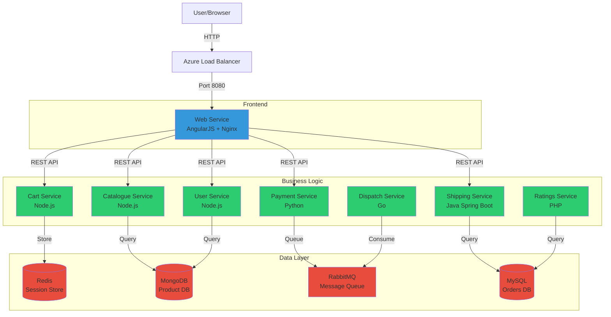

# Microservices Architecture

## Service Details

### Frontend
- **Web**: AngularJS + Nginx (Port 8080)

### Stateless Services
- **Cart**: Node.js - Shopping cart management
- **Catalogue**: Node.js - Product catalog
- **User**: Node.js - User authentication
- **Payment**: Python - Payment processing
- **Shipping**: Java Spring Boot - Shipping calculations
- **Ratings**: PHP - Product ratings
- **Dispatch**: Go - Order dispatch

### Stateful Services
- **MongoDB**: Product and user data
- **MySQL**: Orders and ratings
- **Redis**: Session storage
- **RabbitMQ**: Async messaging

## Communication Patterns

- **Synchronous**: REST APIs (HTTP)
- **Asynchronous**: RabbitMQ (AMQP)
- **Data Storage**: Direct database connections

## Technology Stack

| Service | Language | Framework |
|---------|----------|-----------|
| Web | JavaScript | AngularJS |
| Cart | Node.js | Express |
| Catalogue | Node.js | Express |
| User | Node.js | Express |
| Payment | Python | Flask |
| Shipping | Java | Spring Boot |
| Ratings | PHP | - |
| Dispatch | Go | - |
